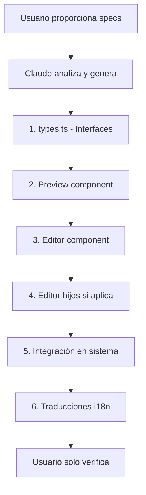

# 📘 Guía Completa para Construir Nuevos Módulos del Website Builder

**Versión**: 2.0 | **Actualizado**: 2025-01-16 | **Cambios**: Diferenciación crítica entre Componentes Estructurales y Secciones del Template

## ⚠️ ADVERTENCIAS CRÍTICAS

### 1. Sincronización de Visibilidad
**IMPORTANTE**: Si tu módulo es un componente estructural (como Header, Footer, AnnouncementBar, CartDrawer), **DEBES** implementar la sincronización de visibilidad entre el store y el context, o el toggle de visibilidad NO se guardará. Ver [Paso 6: Sincronización de Visibilidad](#paso-6-sincronización-de-visibilidad-crítico).

### 2. Detección Móvil y Sincronización Editor-Preview
**CRÍTICO**: TODOS los componentes Preview **DEBEN** implementar la detección móvil correcta para sincronizar con el editor. Sin esto, la vista móvil del editor NO coincidirá con el preview real. Ver implementación obligatoria en [Paso 4](#paso-4-crear-el-preview-real).

### 3. ⚠️ DIFERENCIA CRÍTICA: Componentes Estructurales vs Secciones del Template

**MUY IMPORTANTE**: Entender la diferencia arquitectónica para evitar horas de debugging:

#### **Componentes Estructurales** (Header, Footer, AnnouncementBar, ImageBanner)
- Se guardan en tabla `StructuralComponentsSettings`
- Usan API `/structural-components/`
- Editor debe llamar a `updateImageBannerConfig()`, `updateHeaderConfig()`, etc.
- Aparecen en TODAS las páginas
- NO se guardan con el botón Save de página

#### **Secciones del Template** (Hero, ProductInfo, Gallery, Testimonials, etc.)
- Se guardan en tabla `PageSections`
- Usan API `/websitepages/[id]/sections`
- Editor debe llamar a `updateSectionSettings()` del store
- Son específicas de cada página
- SE GUARDAN con el botón Save de página

**Ejemplo del Error (Image Banner - INCORRECTO):**
```typescript
// ❌ MAL - Image Banner usaba updateSectionSettings (para páginas)
const handleChange = (updates) => {
  updateSectionSettings(groupId, sectionId, updates);
};
```

**Ejemplo Correcto (Image Banner - CORREGIDO):**
```typescript
// ✅ BIEN - Image Banner debe usar API de structural components
import { updateImageBannerConfig } from '@/lib/api/structural-components';

const handleChange = async (updates) => {
  const companyId = parseInt(localStorage.getItem('companyId') || '1');
  await updateImageBannerConfig(companyId, updatedConfig);
};
```

### 4. Theme en Preview - Patrón Dual Obligatorio

**CRÍTICO**: El preview DEBE funcionar tanto en el editor como en el Live Preview:

```typescript
// ✅ SIEMPRE hacer esto en componentes Preview
interface PreviewProps {
  config: any;
  isEditor?: boolean;
  theme?: any; // CRÍTICO: Para Live Preview
}

export default function PreviewComponent({ config, theme, isEditor }: PreviewProps) {
  // Usar theme prop (Live Preview) o store (Editor)
  const storeThemeConfig = useThemeConfigStore(state => state.config);
  const themeConfig = theme || storeThemeConfig;
  
  // Ahora usar themeConfig para colores, tipografía, etc.
}
```

## 🚨 CHECKLIST DE ERRORES COMUNES - VERIFICAR ANTES DE EMPEZAR

Antes de crear tu módulo, asegúrate de:

- [ ] **IMPORTAR EL STORE CORRECTO**: `import { useEditorStore } from '@/stores/useEditorStore';` (NO `@/stores/editorStore`)
- [ ] **USAR EL HOOK CORRECTO**: Para componentes estructurales, usar `useStructuralComponents()` NO `useEditorStore()`
- [ ] **DESESTRUCTURAR CORRECTAMENTE**: `const { config: structuralComponents, update[Module]ConfigLocal } = useStructuralComponents();`
- [ ] **USAR OPTIONAL CHAINING**: Siempre usar `?.` para propiedades anidadas: `localConfig.autoplay?.mode`
- [ ] **MANEJAR UNDEFINED EN HANDLERS**: En `handleNestedChange`, usar `|| {}` para propiedades undefined
- [ ] **VERIFICAR NOMBRES DE FUNCIONES**: Cada módulo tiene su propia función update, ej: `updateAnnouncementBarConfigLocal`
- [ ] **INICIALIZAR CON DEFAULTS**: Siempre tener una función `getDefaultConfig()` con valores completos
- [ ] **NO AGREGAR BOTÓN SAVE**: Los componentes estructurales usan el botón Save global, NO uno individual
- [ ] **ENTENDER EL FLUJO DE GUARDADO**: update[Module]ConfigLocal → hasChanges=true → Save global → publishStructural() → toast.success
- [ ] **MÓDULOS CON HIJOS**: NUNCA poner gestión de hijos en el editor del padre, usar [Module]Children.tsx en el sidebar
- [ ] **SECCIONES VIRTUALES PARA HIJOS**: Si tu módulo tiene hijos, agregar soporte en EditorSidebarWithDnD.tsx para crear sección virtual
- [ ] **ANCHO FIJO EN EDITORES**: SIEMPRE usar `w-[320px]` en el div principal del editor para evitar romper el layout
- [ ] **DETECCIÓN MÓVIL EN PREVIEW**: SIEMPRE implementar el patrón completo de detección móvil con useState y useEffect
- [ ] **PASAR deviceView**: SIEMPRE pasar deviceView desde EditorPreview y PreviewPage a los componentes Preview
- [ ] **HOOKS ANTES DE RETURNS**: TODOS los hooks (useState, useEffect) DEBEN estar antes de cualquier return condicional

## 📋 Tabla de Contenidos
1. [Overview del Sistema](#overview-del-sistema)
2. [Checklist Completo](#checklist-completo)
3. [Paso 1: Crear el Editor del Módulo](#paso-1-crear-el-editor-del-módulo)
4. [Paso 2: Integrar con EditorLayout](#paso-2-integrar-con-editorlayout)
5. [Paso 3: Agregar al EditorPreview (iframe)](#paso-3-agregar-al-editorpreview-iframe)
6. [Paso 4: Crear el Preview Real](#paso-4-crear-el-preview-real)
7. [Paso 5: Integrar con PreviewPage](#paso-5-integrar-con-previewpage)
8. [Paso 6: Backend y Persistencia](#paso-6-backend-y-persistencia)
9. [Paso 7: Testing y Validación](#paso-7-testing-y-validación)
10. [Plantillas de Código](#plantillas-de-código)
11. [Troubleshooting Común](#troubleshooting-común)

---

## Overview del Sistema

### Arquitectura de Doble Preview
```
┌─────────────────────────────────────────────────┐
│                   EDITOR (/editor)               │
├─────────────────────────────────────────────────┤
│  EditorLayout.tsx                                │
│    ├── ModuleEditor.tsx (Panel de config)       │
│    └── EditorPreview.tsx (iframe - cambios live)│
└─────────────────────────────────────────────────┘
                        ↓
                   [SAVE TO DB]
                        ↓
┌─────────────────────────────────────────────────┐
│              PREVIEW REAL (/[handle])            │
├─────────────────────────────────────────────────┤
│  PreviewPage.tsx                                 │
│    └── PreviewModule.tsx (Preview público)      │
└─────────────────────────────────────────────────┘
```

### Flujo de Datos
1. **Editor → Store → EditorPreview** (cambios en tiempo real)
2. **Store → API → Database** (al guardar)
3. **Database → PreviewPage → PreviewModule** (preview público)

---

## Checklist Completo

### 📝 Para cada nuevo módulo necesitas:

- [ ] **Editor Component** (`/components/editor/[Module]Editor.tsx`)
- [ ] **Integración en EditorLayout** (agregar al sidebar)
- [ ] **Renderizado en EditorPreview** (iframe del editor)
- [ ] **Preview Component** (`/components/preview/Preview[Module].tsx`)
- [ ] **Integración en PreviewPage** (preview real)
- [ ] **Sincronización de Visibilidad** (⚠️ CRÍTICO para componentes estructurales)
  - [ ] Función update en StructuralComponentsContext
  - [ ] Lógica en SectionItem.tsx
  - [ ] Sincronización inicial en StructuralComponentsSync.tsx
- [ ] **Backend API** (si es necesario)
- [ ] **Migración de DB** (si es necesario)
- [ ] **Traducciones i18n** (ES y EN)
- [ ] **Documentación** (implementation y troubleshooting)

---

## Paso 1: Crear el Editor del Módulo

### Ubicación
`/websitebuilder-admin/src/components/editor/[Module]Editor.tsx`

### Plantilla Base Completa con Estilos

⚠️ **IMPORTANTE**: Esta plantilla incluye las correcciones para evitar los errores comunes.

#### Campos de Configuración Comunes (Shopify Style)

**Width Select (Full-width control):**
```typescript
// Tipo
width: 'screen' | 'page' | 'large' | 'medium';

// UI Component
<select 
  className="w-full px-2 py-1.5 text-sm border border-gray-300 rounded-md"
  value={localConfig.width}
  onChange={(e) => handleChange('width', e.target.value)}
>
  <option value="screen">Screen</option>
  <option value="page">Page</option>
  <option value="large">Large</option>
  <option value="medium">Medium</option>
</select>
```

**Autoplay Mode (Button Toggle):**
```typescript
// Tipo
autoplay: {
  mode: 'none' | 'one-at-a-time';
  speed: number; // 3-10 seconds
}

// UI Component
<div className="flex gap-2">
  <button
    onClick={() => handleNestedChange('autoplay', 'mode', 'none')}
    className={`flex-1 px-3 py-1.5 text-xs rounded-md ${
      localConfig.autoplay?.mode === 'none' 
        ? 'bg-gray-900 text-white' 
        : 'bg-gray-100 text-gray-700'
    }`}
  >
    None
  </button>
  <button
    onClick={() => handleNestedChange('autoplay', 'mode', 'one-at-a-time')}
    className={`flex-1 px-3 py-1.5 text-xs rounded-md ${
      localConfig.autoplay?.mode === 'one-at-a-time' 
        ? 'bg-gray-900 text-white' 
        : 'bg-gray-100 text-gray-700'
    }`}
  >
    One-at-a-time
  </button>
</div>
```

**Social Media Integration:**
```typescript
// Tipos
socialMediaIcons: {
  enabled: boolean;
  showOnDesktop: boolean;
  iconStyle: 'solid' | 'outline';
}

socialMediaUrls: {
  instagram?: string;
  facebook?: string;
  twitter?: string;
  youtube?: string;
  // ... 19 plataformas totales
}

// Handler para URLs
const handleSocialMediaUrlChange = (platform: string, value: string) => {
  const updatedConfig = {
    ...localConfig,
    socialMediaUrls: {
      ...localConfig.socialMediaUrls,
      [platform]: value
    }
  };
  setLocalConfig(updatedConfig);
  updateConfigLocal(updatedConfig);
};
```

```typescript
'use client';

import React, { useState, useEffect } from 'react';
import { useStructuralComponents } from '@/hooks/useStructuralComponents';
import { ChevronDown, ChevronUp } from 'lucide-react';

interface [Module]Config {
  enabled: boolean;
  // ... resto de la configuración
}

export default function [Module]Editor() {
  // ✅ CORRECTO: Usar useStructuralComponents, no useEditorStore
  const { 
    config: structuralComponents, 
    update[Module]ConfigLocal  // Reemplazar [Module] con el nombre real
  } = useStructuralComponents();
  
  const [isExpanded, setIsExpanded] = useState(true);
  // ✅ CORRECTO: Usar optional chaining
  const [localConfig, setLocalConfig] = useState<[Module]Config>(() => 
    structuralComponents?.[module] || getDefaultConfig()
  );

  // Sincronización con props
  useEffect(() => {
    // ✅ CORRECTO: Optional chaining en useEffect
    const newConfig = structuralComponents?.[module] || getDefaultConfig();
    if (JSON.stringify(newConfig) !== JSON.stringify(localConfig)) {
      setLocalConfig(newConfig);
    }
  }, [structuralComponents?.[module]]);

  // Manejar cambios
  const handleChange = (field: string, value: any) => {
    const updatedConfig = {
      ...localConfig,
      [field]: value
    };
    
    setLocalConfig(updatedConfig);
    // ✅ CORRECTO: Usar la función específica del módulo
    update[Module]ConfigLocal(updatedConfig);
  };

  // ✅ CORRECTO: Manejar propiedades anidadas undefined
  const handleNestedChange = (parent: string, field: string, value: any) => {
    const updatedConfig = {
      ...localConfig,
      [parent]: {
        ...(localConfig[parent as keyof [Module]Config] || {}), // Importante!
        [field]: value
      }
    };
    
    setLocalConfig(updatedConfig);
    update[Module]ConfigLocal(updatedConfig);
  };

  // Configuración por defecto
  function getDefaultConfig() {
    return {
      enabled: true,
      layout: 'default',
      colorScheme: '1',
      // ... configuración específica del módulo
    };
  }

  return (
    <div className="border-b border-gray-200 dark:border-gray-700">
      {/* Header colapsable */}
      <button
        onClick={() => setIsExpanded(!isExpanded)}
        className="w-full px-4 py-3 flex items-center justify-between hover:bg-gray-50 dark:hover:bg-gray-800"
      >
        <span className="font-medium text-gray-900 dark:text-white">
          [Module Name]
        </span>
        {isExpanded ? 
          <ChevronUp className="w-4 h-4 text-gray-500" /> : 
          <ChevronDown className="w-4 h-4 text-gray-500" />
        }
      </button>

      {/* Contenido */}
      {isExpanded && (
        <div className="px-4 pb-4 space-y-4">
          
          {/* Toggle de habilitado */}
          <div className="flex items-center justify-between">
            <label className="text-xs font-medium text-gray-700 dark:text-gray-300">
              Enable [Module]
            </label>
            <button
              onClick={() => handleChange('enabled', !localConfig.enabled)}
              className={`relative inline-flex h-5 w-9 items-center rounded-full transition-colors ${
                localConfig.enabled ? 'bg-blue-500' : 'bg-gray-300 dark:bg-gray-600'
              }`}
            >
              <span className={`inline-block h-3.5 w-3.5 transform rounded-full bg-white transition-transform ${
                localConfig.enabled ? 'translate-x-5' : 'translate-x-1'
              }`} />
            </button>
          </div>

          {/* Layout selector */}
          <div>
            <label className="block text-xs font-medium text-gray-700 dark:text-gray-300 mb-1.5">
              Layout
            </label>
            <div className="flex gap-2">
              {['default', 'compact', 'expanded'].map(layout => (
                <button
                  key={layout}
                  onClick={() => handleChange('layout', layout)}
                  className={`flex-1 px-3 py-1.5 text-xs rounded-md transition-colors capitalize ${
                    localConfig.layout === layout 
                      ? 'bg-gray-900 text-white dark:bg-white dark:text-gray-900' 
                      : 'bg-gray-100 text-gray-700 hover:bg-gray-200 dark:bg-gray-800 dark:text-gray-300 dark:hover:bg-gray-700'
                  }`}
                >
                  {layout}
                </button>
              ))}
            </div>
          </div>

          {/* Color scheme selector */}
          <div>
            <label className="block text-xs font-medium text-gray-700 dark:text-gray-300 mb-1.5">
              Color scheme
            </label>
            <select 
              className="w-full px-2 py-1.5 text-sm border border-gray-300 rounded-md 
                         focus:outline-none focus:ring-1 focus:ring-blue-500 
                         dark:bg-gray-800 dark:border-gray-600 dark:text-white"
              value={localConfig.colorScheme}
              onChange={(e) => handleChange('colorScheme', e.target.value)}
            >
              <option value="1">Scheme 1</option>
              <option value="2">Scheme 2</option>
              <option value="3">Scheme 3</option>
              <option value="4">Scheme 4</option>
            </select>
            <p className="mt-1 text-xs text-gray-500 dark:text-gray-400">
              Uses the color scheme from global settings
            </p>
          </div>

          {/* Separador de sección */}
          <div className="border-t border-gray-200 dark:border-gray-700 pt-4">
            <h3 className="text-sm font-semibold text-gray-900 dark:text-white mb-3">
              Advanced Settings
            </h3>
            
            {/* Más controles aquí */}
          </div>
        </div>
      )}
    </div>
  );
}
```

### Reglas Importantes
1. **SIEMPRE** usar `localConfig` para estado local
2. **SIEMPRE** sincronizar con `useEffect`
3. **SIEMPRE** actualizar el store con `updateStructuralComponent`
4. **NUNCA** comparar objetos directamente, usar `JSON.stringify`

---

## 🎨 Implementación de Color Schemes

### ⚠️ IMPORTANTE: Los Color Schemes vienen del Store Global

Los color schemes NO son colores hardcodeados. Se obtienen del `useThemeConfigStore` que contiene hasta 5 schemes configurables globalmente.

### Paso 1: En el Editor - Mostrar nombres reales de schemes

```typescript
// ImageBannerEditor.tsx (o tu módulo)
import useThemeConfigStore from '@/stores/useThemeConfigStore'; // ⚠️ Sin llaves - es default export

export default function ImageBannerEditor({ sectionId }: Props) {
  const { config: themeConfig } = useThemeConfigStore();
  
  // En el JSX del selector:
  <select 
    value={localConfig.colorScheme}
    onChange={(e) => handleChange({ colorScheme: e.target.value })}
  >
    {themeConfig?.colorSchemes?.schemes?.map((scheme, index) => (
      <option key={scheme.id} value={String(index + 1)}>
        {scheme.name} {/* Muestra el nombre real del scheme */}
      </option>
    )) || [1, 2, 3, 4, 5].map(num => (
      <option key={num} value={String(num)}>Scheme {num}</option>
    ))}
  </select>
  <p className="mt-1 text-xs text-gray-500">
    Uses the color scheme from global settings
  </p>
```

### Paso 2: En el Preview - Usar colores del scheme seleccionado

```typescript
// PreviewImageBanner.tsx (o tu preview)
import React, { useMemo } from 'react';
import useThemeConfigStore from '@/stores/useThemeConfigStore'; // ⚠️ Sin llaves

export function PreviewImageBanner({ config, isEditor }: Props) {
  const { config: themeConfig } = useThemeConfigStore();
  
  // Obtener el scheme seleccionado
  const colorScheme = useMemo(() => {
    if (!themeConfig?.colorSchemes?.schemes) {
      // Fallback si no hay config
      return {
        text: '#000000',
        background: '#FFFFFF',
        solidButton: '#000000',
        solidButtonText: '#FFFFFF',
        outlineButton: '#000000',
        outlineButtonText: '#000000',
        link: '#0066CC',
        border: '#E5E5E5',
        imageOverlay: '#000000'
      };
    }
    
    // config.colorScheme es "1", "2", etc. - convertir a índice
    const schemeIndex = parseInt(config.colorScheme) - 1;
    const selectedScheme = themeConfig.colorSchemes.schemes[schemeIndex];
    
    return selectedScheme || themeConfig.colorSchemes.schemes[0];
  }, [themeConfig, config.colorScheme]);
  
  // Usar los colores con style inline (porque son valores hex)
  return (
    <div style={{ color: colorScheme.text }}>
      <button 
        style={{
          backgroundColor: colorScheme.solidButton,
          color: colorScheme.solidButtonText
        }}
      >
        Button
      </button>
    </div>
  );
}
```

### Paso 3: Estructura de un Color Scheme

Cada scheme tiene estos colores disponibles:

```typescript
interface ColorScheme {
  id: string;           // Identificador único
  name: string;         // Nombre mostrado al usuario
  text: string;         // Color de texto principal
  background: string;   // Color de fondo
  foreground: string;   // Color de primer plano
  border: string;       // Color de bordes
  link: string;         // Color de enlaces
  solidButton: string;  // Fondo de botón sólido
  solidButtonText: string;      // Texto de botón sólido
  outlineButton: string;        // Borde de botón outline
  outlineButtonText: string;    // Texto de botón outline
  imageOverlay: string;         // Color de overlay sobre imágenes
}
```

### Paso 4: Helpers para aplicar estilos

```typescript
// Helpers para aplicar estilos según el tipo
const getButtonStyles = (style: 'solid' | 'outline' | 'text') => {
  switch (style) {
    case 'solid':
      return {
        backgroundColor: colorScheme.solidButton,
        color: colorScheme.solidButtonText
      };
    case 'outline':
      return {
        borderColor: colorScheme.outlineButton,
        color: colorScheme.outlineButtonText,
        backgroundColor: 'transparent',
        borderWidth: '2px',
        borderStyle: 'solid'
      };
    case 'text':
      return {
        color: colorScheme.link,
        backgroundColor: 'transparent',
        textDecoration: 'underline'
      };
  }
};

// Aplicar en JSX
<button style={getButtonStyles(config.buttonStyle)}>
  Click me
</button>
```

### ⚠️ Errores Comunes y Soluciones

1. **Error: `useThemeConfigStore is not a function`**
   - ❌ `import { useThemeConfigStore } from '@/stores/useThemeConfigStore';`
   - ✅ `import useThemeConfigStore from '@/stores/useThemeConfigStore';`

2. **Los colores no se aplican**
   - Usa `style` inline para colores hex: `style={{ color: colorScheme.text }}`
   - NO uses clases Tailwind con variables: ❌ `className={`text-[${color}]`}`

3. **El scheme no cambia en el preview**
   - Asegúrate de usar `useMemo` con las dependencias correctas
   - Verifica que `config.colorScheme` esté llegando como string ("1", "2", etc.)

### Ejemplo Completo de Implementación

Ver implementación en:
- Editor: `/src/components/editor/modules/ImageBanner/ImageBannerEditor.tsx`
- Preview: `/src/components/editor/modules/ImageBanner/PreviewImageBanner.tsx`

---

## Paso 2: Integrar con EditorLayout

### Archivo a modificar
`/websitebuilder-admin/src/components/editor/EditorLayout.tsx`

### Agregar al Sidebar
```typescript
// 1. Importar el componente
import [Module]Editor from './[Module]Editor';

// 2. Agregar en la sección correcta del sidebar
{activeSection === 'structural-components' && (
  <div className="p-4 space-y-4">
    <HeaderEditor />
    <[Module]Editor />  {/* Agregar aquí */}
    <FooterEditor />
    <CartDrawerEditor />
  </div>
)}
```

---

## Paso 3: Agregar al EditorPreview (iframe)

### Archivo a modificar
`/websitebuilder-admin/src/components/editor/EditorPreview.tsx`

### ⚠️ IMPORTANTE: Pasar deviceView al componente Preview

### Agregar el renderizado con deviceView
```typescript
// 1. Importar el componente Preview
import Preview[Module] from '@/components/preview/Preview[Module]';

// 2. En el switch de renderSectionPreview, agregar el caso:
case SectionType.[MODULE]:
  return (
    <Preview[Module]
      config={moduleConfig || structuralComponents?.[module]}
      theme={themeConfig}
      deviceView={deviceView}  // CRÍTICO: Pasar deviceView
      isEditor={true}          // CRÍTICO: Indicar contexto editor
    />
  );

// 3. El deviceView viene del estado del EditorPreview
const [deviceView, setDeviceView] = useState<'desktop' | 'mobile'>('desktop');

// 4. NUNCA renderizar código duplicado, siempre usar el componente Preview compartido
  // Aplicar estilos del theme
  const colorScheme = getColorScheme(config.colorScheme);
  
  return (
    <div style={{
      backgroundColor: colorScheme?.background || '#ffffff',
      color: colorScheme?.text || '#000000'
    }}>
      {/* Contenido del módulo */}
    </div>
  );
};
```

---

## Paso 4: Crear el Preview UNIFICADO (Editor + Preview Real)

### 🚨 CAMBIO CRÍTICO: Arquitectura Unificada de Preview (14 enero 2025)

**IMPORTANTE**: Desde el refactor del Live Preview, usamos **UN SOLO componente Preview** que sirve tanto para EditorPreview.tsx como para PreviewPage.tsx. **NUNCA duplicar código de renderizado**.

### ❌ Arquitectura Anterior (NUNCA HACER ESTO)
```
ANTES (Código duplicado - PROBLEMA):
├── EditorPreview.tsx: 200 líneas para renderizar el módulo
└── PreviewModule.tsx: OTRAS 200 líneas casi idénticas
Resultado: 
  - Arreglas bug en uno, olvidas el otro
  - Divergencia entre editor y preview
  - Doble mantenimiento
```

### ✅ Arquitectura Nueva (SIEMPRE USAR ESTO)
```
AHORA (Componente unificado - SOLUCIÓN):
├── Preview[Module].tsx (UN SOLO archivo, 400 líneas)
│   ├── EditorPreview.tsx: import Preview[Module] → 5 líneas
│   └── PreviewPage.tsx: import Preview[Module] → 5 líneas
Resultado:
  - Cambias una vez, funciona en ambos
  - Consistencia 100% garantizada
  - Mantenimiento único
```

### Ubicación
`/websitebuilder-admin/src/components/preview/Preview[Module].tsx`

### Principios de la Arquitectura Unificada

| Principio | Descripción | Implementación |
|-----------|-------------|----------------|
| **Single Source of Truth** | UN componente para AMBOS contextos | `Preview[Module].tsx` compartido |
| **Prop isEditor** | Diferencia editor vs preview real | `isEditor={true/false}` |
| **Theme Dual Pattern** | Theme desde prop o store | `theme \|\| storeThemeConfig` |
| **Mobile Detection** | Sincronización con editor | `deviceView` prop obligatorio |
| **Hooks Order** | TODOS los hooks antes de returns | Evita errores de React |

### ⚠️ CRÍTICO: Detección Móvil y Sincronización Editor-Preview

**TODOS los componentes Preview DEBEN implementar la detección móvil correcta** para sincronizar con el editor:

#### Implementación OBLIGATORIA de Detección Móvil:

```typescript
'use client';

import React, { useState, useEffect } from 'react';

interface Preview[Module]Props {
  config: any;
  theme: any;
  deviceView?: 'desktop' | 'mobile';  // CRÍTICO: Recibir deviceView
  isEditor?: boolean;
}

export default function Preview[Module]({ 
  config, 
  theme,
  deviceView,  // CRÍTICO: Desestructurar deviceView
  isEditor = false  // CRÍTICO: Diferencia contextos
}: Preview[Module]Props) {
  
  // 🎯 PATRÓN DUAL OBLIGATORIO: Theme desde prop o store
  const storeThemeConfig = useThemeConfigStore(state => state.config);
  const themeConfig = theme || storeThemeConfig;
  // ↑ En EditorPreview: usa store | En PreviewPage: usa prop
  
  // ⚠️ IMPLEMENTACIÓN OBLIGATORIA DE DETECCIÓN MÓVIL
  const [isMobile, setIsMobile] = useState(() => {
    // Prioridad 1: Usar deviceView si está definido (viene del editor)
    if (deviceView !== undefined) return deviceView === 'mobile';
    // Prioridad 2: Detectar viewport real si no hay deviceView
    if (typeof window !== 'undefined') return window.innerWidth < 768;
    // Prioridad 3: Default false para SSR
    return false;
  });
  
  // Sincronizar con cambios de deviceView o viewport
  useEffect(() => {
    const checkMobile = () => {
      if (deviceView !== undefined) {
        // Si hay deviceView del editor, usarlo siempre
        setIsMobile(deviceView === 'mobile');
        return;
      }
      // Si no hay deviceView, detectar viewport real
      const isMobileView = window.innerWidth < 768;
      setIsMobile(isMobileView);
    };
    
    checkMobile();
    window.addEventListener('resize', checkMobile);
    
    return () => window.removeEventListener('resize', checkMobile);
  }, [deviceView]);
  
  // AHORA TODOS LOS HOOKS ANTES DE RETURNS CONDICIONALES
  // Validar configuración DESPUÉS de todos los hooks
  if (!isEditor && !config?.enabled) {
    return null;
  }

  // Extraer configuración del theme (usa themeConfig unificado)
  const colorScheme = themeConfig?.colorSchemes?.schemes?.[parseInt(config.colorScheme || '1') - 1];
  // ↑ IMPORTANTE: Usar themeConfig, NO theme directamente
  
  // Usar isMobile para ajustar layouts
  const columnsClass = isMobile ? 'grid-cols-1' : 'grid-cols-3';
  const iconSize = isMobile ? 'w-4 h-4' : 'w-5 h-5';
  const spacing = isMobile ? 'gap-2' : 'gap-4';
  
  // Aplicar typography si es necesario
  const typographyStyles = theme?.typography?.module ? {
    fontFamily: `'${theme.typography.module.fontFamily}', sans-serif`,
    fontSize: theme.typography.module.fontSize ? 
      `${theme.typography.module.fontSize}px` : '16px',
    // ... más estilos
  } : {};

  // Renderizar el módulo
  return (
    <div 
      className="module-wrapper"
      style={{
        backgroundColor: colorScheme?.background?.default || '#ffffff',
        color: colorScheme?.text?.default || '#000000',
        ...typographyStyles
      }}
    >
      {/* IMPORTANTE: Copiar la lógica de renderizado desde EditorPreview */}
      {/* pero adaptada para datos que vienen del API */}
    </div>
  );
}
```

### Patrón isEditor para Comportamiento Diferenciado
```typescript
// Ejemplo completo con patrón dual de theme
export default function Preview[Module]({ config, theme, isEditor = false }) {
  // 🎯 PATRÓN DUAL: Theme unificado
  const storeThemeConfig = useThemeConfigStore(state => state.config);
  const themeConfig = theme || storeThemeConfig;
  
  // Comportamiento específico del editor (opcional)
  if (isEditor && config.showEditBorders) {
    return (
      <div className="relative group">
        {/* Indicador visual solo en editor */}
        <div className="absolute inset-0 border-2 border-dashed border-gray-300 opacity-0 group-hover:opacity-100" />
        {renderContent(themeConfig)}
      </div>
    );
  }
  
  // Comportamiento para preview real
  return renderContent(themeConfig);
}
```

### ⚠️ REGLA DE ORO: Un Componente, Dos Contextos

```typescript
// ❌ NUNCA HACER ESTO (Duplicar código)
// EditorPreview.tsx: 200 líneas para renderizar módulo
// PreviewModule.tsx: OTRAS 200 líneas casi idénticas

// ✅ SIEMPRE HACER ESTO (Componente unificado)
// PreviewModule.tsx: UN componente que sirve para ambos
// EditorPreview.tsx: <PreviewModule isEditor={true} />
// PreviewPage.tsx: <PreviewModule isEditor={false} />
```

### Beneficios de la Arquitectura Unificada

| Beneficio | Antes (Duplicado) | Ahora (Unificado) | Mejora |
|-----------|-------------------|-------------------|--------|
| **Código** | 400 líneas (200+200) | 200 líneas totales | -50% |
| **Bugs** | Arreglar en 2 lugares | Arreglar en 1 lugar | -50% tiempo |
| **Testing** | Probar 2 componentes | Probar 1 componente | -50% tests |
| **Consistencia** | Posible divergencia | Imposible divergencia | 100% sync |
| **Bundle Size** | 2 componentes en bundle | 1 componente | Menor tamaño |
| **Desarrollo** | Escribir 2 veces | Escribir 1 vez | -50% tiempo |

---

## Paso 5: Integrar el Componente Unificado en Ambos Contextos

### 5.1 Integración en EditorPreview.tsx (Contexto Editor)

`/websitebuilder-admin/src/components/editor/EditorPreview.tsx`

```typescript
// 1. Importar el componente unificado
import Preview[Module] from '@/components/preview/Preview[Module]';

// 2. En el switch de renderizado de secciones
case SectionType.[MODULE]:
  return (
    <Preview[Module]
      config={config || structuralComponents?.[module]}
      theme={themeConfig}  // Theme del store
      deviceView={deviceView}
      isEditor={true}  // 🎯 CRÍTICO: Marca como editor
    />
  );
```

### 5.2 Integración en PreviewPage.tsx (Contexto Preview Real)

`/websitebuilder-admin/src/components/preview/PreviewPage.tsx`

```typescript
// 1. Importar el MISMO componente
import Preview[Module] from './Preview[Module]';

// 2. PreviewPage ya tiene lógica para detectar editorDeviceView
const [editorDeviceView, setEditorDeviceView] = useState<'desktop' | 'mobile' | undefined>();

useEffect(() => {
  // Escucha cambios del editor via localStorage
  const handleStorageChange = (e: StorageEvent) => {
    if (e.key === 'editorDeviceView') {
      setEditorDeviceView(e.newValue as 'desktop' | 'mobile' | undefined);
    }
  };
  
  // Carga inicial
  const stored = localStorage.getItem('editorDeviceView');
  if (stored) setEditorDeviceView(stored as 'desktop' | 'mobile');
  
  window.addEventListener('storage', handleStorageChange);
  return () => window.removeEventListener('storage', handleStorageChange);
}, []);

// 3. En el JSX, agregar donde corresponda CON deviceView
{structuralComponents?.[module] && (
  <Preview[Module] 
    config={structuralComponents.[module]}
    theme={globalTheme}  // Theme desde API
    deviceView={editorDeviceView}  // CRÍTICO: Pasar editorDeviceView
    isEditor={false}  // 🎯 CRÍTICO: Marca como preview real
  />
)}
```

### Diferencias Entre Contextos

| Aspecto | EditorPreview.tsx | PreviewPage.tsx |
|---------|-------------------|------------------|
| **Prop isEditor** | `true` | `false` |
| **Theme source** | Zustand store | API prop |
| **Interactividad** | Editable | Solo lectura |
| **Renderizado** | En iframe | Página completa |
| **DeviceView** | Controlado por editor | Sync con localStorage |

### Orden de renderizado típico
1. AnnouncementBar
2. Header  
3. Content (Secciones del template)
4. Footer
5. CartDrawer

---

## 🔄 Arquitectura Unificada: Errores Comunes y Soluciones

### ❌ Errores Comunes al Implementar Preview Unificado

| Error | Consecuencia | Solución |
|-------|--------------|----------|
| Crear 2 archivos Preview | Duplicación, inconsistencias | UN solo Preview[Module].tsx |
| Olvidar prop `isEditor` | No diferencia contextos | Siempre pasar `isEditor={true/false}` |
| No usar patrón dual de theme | Theme undefined en editor | `const themeConfig = theme \|\| storeThemeConfig` |
| Hooks después de returns | Error "Rendered more hooks" | TODOS los hooks antes de returns |
| No pasar `deviceView` | Móvil no sincroniza | Siempre pasar prop `deviceView` |
| **No integrar en PreviewContent** | **No se ve en preview real** | **Agregar caso en PreviewContent.tsx** |
| **Config sin valores por defecto** | **Estructura no visible en editor** | **Agregar fallbacks para todos los valores** |

### ✅ Checklist de Implementación Correcta

```typescript
// Preview[Module].tsx - ESTRUCTURA CORRECTA
export default function Preview[Module](props) {
  // ✅ 1. Props completos con isEditor
  const { config, theme, deviceView, isEditor = false } = props;
  
  // ✅ 2. Patrón dual de theme
  const storeTheme = useThemeConfigStore(state => state.config);
  const themeConfig = theme || storeTheme;
  
  // ✅ 3. Detección móvil con deviceView
  const [isMobile, setIsMobile] = useState(() => {
    if (deviceView !== undefined) return deviceView === 'mobile';
    return window.innerWidth < 768;
  });
  
  // ✅ 4. TODOS los hooks antes de returns
  useEffect(() => { /* ... */ }, [deviceView]);
  
  // ✅ 5. Returns condicionales AL FINAL
  if (!config?.enabled && !isEditor) return null;
  
  // ✅ 6. Renderizado usando themeConfig
  return <div>{/* contenido */}</div>;
}
```

### 📋 Ejemplo Real: PreviewAnnouncementBar.tsx

Ver implementación completa en:
- `/src/components/preview/PreviewAnnouncementBar.tsx` (400 líneas)
- Usada en EditorPreview.tsx: solo 5 líneas para importar y usar
- Usada en PreviewPage.tsx: las mismas 5 líneas

## Paso 6: Sistema de Guardado y Botón Save (CRÍTICO)

### ⚠️ IMPORTANTE: Cómo funciona el guardado para componentes estructurales

Los componentes estructurales (Header, Footer, AnnouncementBar, CartDrawer) NO tienen botón Save individual. Se guardan a través del **botón Save global** en la barra superior del editor.

#### 📊 Flujo de Guardado Completo:

```
1. Usuario edita en [Module]Editor
       ↓
2. Llama a update[Module]ConfigLocal()
       ↓
3. StructuralComponentsContext marca hasChanges = true
       ↓
4. Botón Save aparece en barra superior (/editor/page.tsx)
       ↓
5. Usuario hace clic en Save global
       ↓
6. Llama a publishStructural() que:
   - Guarda cada componente modificado via API
   - Llama a publishStructuralComponents()
       ↓
7. Muestra toast.success('Cambios guardados exitosamente')
```

#### 📝 Implementación en StructuralComponentsContext:

```typescript
// En StructuralComponentsContext.tsx
const publish = async () => {
  try {
    // Guarda cada componente modificado
    if (config.announcementBar) {
      await updateAnnouncementBarConfig(company.id, config.announcementBar);
    }
    // ... otros componentes ...
    
    // Publica los cambios
    await publishStructuralComponents(company.id);
    
    // Resetea hasChanges
    setHasChanges(false);
    return true; // Indica éxito
  } catch (error) {
    console.error('Error publishing:', error);
    return false;
  }
};
```

#### 🎯 En el Editor Principal (/editor/page.tsx):

```typescript
const handleSave = async () => {
  setIsSavingLocal(true);
  try {
    let changesSaved = false;
    
    // Guarda componentes estructurales si hay cambios
    if (hasStructuralChanges) {
      const success = await publishStructural();
      if (success) {
        await refresh();
        changesSaved = true;
      }
    }
    
    // Muestra mensaje de éxito
    if (changesSaved) {
      toast.success('Cambios guardados exitosamente');
    }
  } catch (error) {
    toast.error('Error al guardar los cambios');
  } finally {
    setIsSavingLocal(false);
  }
};
```

#### ✅ Puntos Clave del Sistema de Guardado:

1. **NO hay botón Save individual** en los editores de componentes estructurales
2. **El botón Save global** aparece automáticamente cuando `hasChanges = true`
3. **Todos los componentes estructurales** se guardan juntos en una sola operación
4. **El mensaje de éxito** se muestra desde `/editor/page.tsx`, no desde el contexto
5. **La función update[Module]ConfigLocal** SOLO actualiza el estado local, NO guarda en backend

#### ❌ Errores Comunes:

- **NO** agregar un botón Save dentro del editor del componente
- **NO** llamar directamente a la API desde el editor
- **NO** mostrar toast.success desde el contexto (se hace en page.tsx)
- **NO** olvidar marcar `hasChanges = true` en la función update

## Paso 7: Módulos con Elementos Hijos (IMPORTANTE)

### ⚠️ ARQUITECTURA DE MÓDULOS CON HIJOS

Algunos módulos pueden tener elementos hijos (ej: AnnouncementBar tiene anuncios individuales, Navigation tiene items de menú). Es **CRÍTICO** entender la arquitectura correcta.

#### ❌ INCORRECTO - NO hacer esto:
```
AnnouncementBarEditor.tsx
├── Configuración global
└── Gestión de anuncios ❌
    ├── Agregar anuncio
    ├── Editar anuncio
    └── Eliminar anuncio
```

#### ✅ CORRECTO - Arquitectura adecuada:
```
EditorSidebarWithDnD.tsx (Sidebar principal)
├── Announcement bar (componente padre)
│   └── AnnouncementChildren.tsx
│       ├── (+) Agregar Announcement
│       ├── Announcement - Free Shipping
│       └── Announcement - Holiday Sale
│
└── AnnouncementBarEditor.tsx (Solo configuración global)
    ├── Color scheme
    ├── Autoplay
    └── Selectores
```

### 📊 Flujo de Implementación para Módulos con Hijos:

#### 1. **Componente [Module]Children.tsx**
Crea un componente separado para manejar los hijos en el sidebar:

```typescript
// AnnouncementChildren.tsx
export function AnnouncementChildren({ section, groupId }) {
  const { config, update[Module]ConfigLocal } = useStructuralComponents();
  
  const handleAddChild = () => {
    const newChild = {
      id: `child-${Date.now()}`,
      text: 'New Item',
      // ... propiedades del hijo
    };
    
    const updatedConfig = {
      ...config.module,
      children: [...config.module.children, newChild]
    };
    
    update[Module]ConfigLocal(updatedConfig);
  };
  
  return (
    <div className="pl-8">
      {/* Botón Agregar */}
      <button onClick={handleAddChild} className="...">
        <Plus className="w-3 h-3" />
        <span>Agregar {ChildType}</span>
      </button>
      
      {/* Lista de hijos */}
      {children.map(child => (
        <div key={child.id} onClick={() => selectChild(child.id)}>
          <RefreshCw className="w-3 h-3" />
          <span>{child.text}</span>
          {/* Acciones: visibilidad, eliminar */}
        </div>
      ))}
    </div>
  );
}
```

#### 2. **Integración en EditorSidebarWithDnD**
Renderiza los hijos después del componente padre:

```typescript
// EditorSidebarWithDnD.tsx
{groupSections.map((section, index) => (
  <div key={section.id}>
    <DraggableSection>
      <SectionItem section={section} />
    </DraggableSection>
    
    {/* Renderizar hijos si el módulo los tiene */}
    {section.type === SectionType.MODULE_WITH_CHILDREN && (
      <ModuleChildren section={section} groupId={group.id} />
    )}
  </div>
))}
```

#### 3. **ConfigPanel para Hijos**
Cuando se selecciona un hijo, mostrar su configuración individual:

```typescript
// ConfigPanel.tsx
case 'ANNOUNCEMENT_ITEM':
  return <AnnouncementItemEditor item={section.settings} />;
```

### ✅ Reglas de UX para Módulos con Hijos:

1. **NUNCA** poner gestión de hijos en el editor del módulo padre
2. **SIEMPRE** usar un componente [Module]Children separado
3. **El botón "Agregar"** va en el sidebar, no en la configuración
4. **Cada hijo** es un elemento clickeable en el sidebar
5. **La configuración del padre** solo tiene settings globales
6. **La configuración del hijo** tiene settings específicos del item

### 📝 Ejemplos de Módulos con Hijos:

| Módulo Padre | Elementos Hijos | Botón en Sidebar |
|--------------|-----------------|------------------|
| AnnouncementBar | Anuncios individuales | (+) Agregar Announcement |
| Navigation | Items de menú | (+) Agregar Item |
| Footer | Columnas/Links | (+) Agregar Columna |
| ProductGrid | Productos destacados | (+) Agregar Producto |

### ⚠️ Checklist para Módulos con Hijos:

- [ ] Crear componente [Module]Children.tsx
- [ ] NO incluir gestión de hijos en [Module]Editor.tsx
- [ ] Integrar en EditorSidebarWithDnD
- [ ] Implementar selección de hijos individuales
- [ ] Crear editor específico para configuración de hijos
- [ ] Manejar acciones (agregar, eliminar, toggle visibilidad)
- [ ] Usar iconos apropiados (Plus para agregar, RefreshCw para items)
- [ ] **CRÍTICO**: Implementar botón de retroceso funcional en editor de hijos
- [ ] **CRÍTICO**: Agregar sección virtual en EditorSidebarWithDnD.tsx
- [ ] **CRÍTICO**: Usar ancho fijo `w-[320px]` en editor de hijos

### 📝 Plantilla para Editor de Hijos

```typescript
/**
 * @file [Module][ChildType]Editor.tsx
 * @max-lines 300
 * Configuration editor for [Module] [ChildType] items
 */

'use client';

import React, { useState, useEffect } from 'react';
import { ArrowLeft } from 'lucide-react';
import { useStructuralComponents } from '@/hooks/useStructuralComponents';
import { useEditorStore } from '@/stores/useEditorStore';

interface [Module][ChildType]EditorProps {
  [childId]: string;
}

export default function [Module][ChildType]Editor({ [childId] }: [Module][ChildType]EditorProps) {
  const { config: structuralComponents, update[Module]ConfigLocal } = useStructuralComponents();
  const { toggleConfigPanel, selectSection } = useEditorStore();
  
  // Get the specific child from parent config
  const parentConfig = structuralComponents?.[module] || {};
  const children = parentConfig.[children] || [];
  const currentChild = children.find(c => c.id === [childId]);
  
  // Initialize local state
  const [localSettings, setLocalSettings] = useState(() => {
    return currentChild?.settings || getDefaultSettings();
  });

  // Sync with props
  useEffect(() => {
    const child = children.find(c => c.id === [childId]);
    if (child?.settings) {
      const newSettings = child.settings;
      if (JSON.stringify(newSettings) !== JSON.stringify(localSettings)) {
        setLocalSettings(newSettings);
      }
    }
  }, [[childId], children]);

  const handleBack = () => {
    // CRITICAL: Close panel and return to sidebar, NOT to parent config
    toggleConfigPanel(false);
    selectSection(null);
  };

  const handleChange = (field: string, value: any) => {
    const updatedSettings = {
      ...localSettings,
      [field]: value
    };
    
    setLocalSettings(updatedSettings);
    
    // Update the child in parent config
    const updatedChildren = children.map(child => 
      child.id === [childId] 
        ? { ...child, settings: updatedSettings }
        : child
    );
    
    const updatedConfig = {
      ...parentConfig,
      [children]: updatedChildren
    };
    
    update[Module]ConfigLocal(updatedConfig);
  };

  function getDefaultSettings() {
    return {
      // Default settings for this child type
    };
  }

  return (
    <div className="w-[320px] h-full bg-white dark:bg-gray-900 border-r border-gray-200 dark:border-gray-700 flex flex-col">
      {/* Header */}
      <div className="flex items-center gap-3 px-4 py-3 border-b border-gray-200 dark:border-gray-700">
        <button
          onClick={handleBack}
          className="p-1.5 hover:bg-gray-100 dark:hover:bg-gray-800 rounded-md transition-colors"
          aria-label="Volver"
        >
          <ArrowLeft className="w-4 h-4 text-gray-600 dark:text-gray-400" />
        </button>
        <h2 className="text-base font-medium text-gray-900 dark:text-white">
          [Child Type Name]
        </h2>
      </div>

      {/* Content */}
      <div className="flex-1 overflow-y-auto">
        <div className="p-4 space-y-4">
          {/* Configuration fields here */}
        </div>
      </div>
    </div>
  );
}
```

### 🔴 ERROR COMÚN: Return Condicional Antes de Hooks

**Problema**: Error "Rendered more hooks than during the previous render"

**Causa**: Return condicional antes de los hooks de React.

**Solución**:
```typescript
// ❌ INCORRECTO - Return antes de hooks
export function ConfigPanel({ section }) {
  const isChild = section.id.startsWith('child-');
  if (isChild) {
    return <ChildEditor />;  // ERROR: Return antes de hooks
  }
  
  const [state, setState] = useState();
  useEffect(() => {}, []);
}

// ✅ CORRECTO - Return después de todos los hooks
export function ConfigPanel({ section }) {
  const [state, setState] = useState();
  useEffect(() => {}, []);
  
  const isChild = section.id.startsWith('child-');
  
  // Return DESPUÉS de todos los hooks
  if (isChild) {
    return <ChildEditor />;
  }
}
```

### 🔴 CORRECCIONES CRÍTICAS PARA MÓDULOS CON HIJOS (Actualizado 17/01/2025)

#### ⚠️ Problema 1: Vista de configuración padre cortada (overflow)
**Síntomas:** El contenido se desborda hacia la derecha, los controles se cortan, los botones de colapso no se ven.

**❌ INCORRECTO:**
```typescript
// Editor con ancho fijo restrictivo
<div className="w-[320px] h-full overflow-x-hidden">
  <input className="flex-1" />
  <span className="w-12">{value}</span> {/* Ancho fijo causa overflow */}
</div>
```

**✅ CORRECTO:**
```typescript
// Editor sin ancho fijo, sliders flexibles
<div className="h-full bg-white dark:bg-gray-900 flex flex-col">
  <div className="flex-1 overflow-y-auto">
    <input className="flex-1 min-w-0" />     {/* min-w-0 permite encogerse */}
    <span className="flex-shrink-0">{value}</span> {/* flex-shrink-0 mantiene tamaño */}
  </div>
</div>
```

**Reglas para evitar overflow:**
- NO usar `w-[320px]` o anchos fijos en el contenedor principal
- Usar `flex-1 min-w-0` en inputs de sliders
- Usar `flex-shrink-0` en spans de valores
- NO forzar `overflow-x-hidden` que oculta contenido

#### ⚠️ Problema 2: Click en hijos no abre configuración
**Síntomas:** Al hacer click en un hijo, no se abre el editor correcto o no pasa nada.

**SOLUCIÓN COMPLETA - 3 archivos necesarios:**

**1. En [Module]Children.tsx - Usar formato especial para hijos:**
```typescript
const handleSelectItem = (itemId: string) => {
  // CRÍTICO: Usar formato especial para hijos con :child:
  selectSection(`${section.id}:child:${itemId}`);
  toggleConfigPanel(true);
};
```

**2. En ConfigPanel.tsx - Detectar y renderizar editor de hijos:**
```typescript
// Al inicio, detectar si es un hijo del módulo
const isMulticolumnsItem = selectedSectionId?.includes(':child:') && !isSlideItem;
const getMulticolumnsSectionId = () => {
  if (!isMulticolumnsItem || !selectedSectionId) return null;
  return selectedSectionId.split(':child:')[0];
};
const getMulticolumnsItemId = () => {
  if (!isMulticolumnsItem || !selectedSectionId) return null;
  return selectedSectionId.split(':child:')[1];
};

// Renderizar editor correcto DESPUÉS de todos los hooks
if (isMulticolumnsItem) {
  const sectionId = getMulticolumnsSectionId();
  const itemId = getMulticolumnsItemId();
  if (sectionId && itemId) {
    return <MulticolumnsItemEditor sectionId={sectionId} itemId={itemId} />;
  }
}
```

**3. En EditorSidebarWithDnD.tsx - Crear sección virtual para hijos:**
```typescript
// Después de buscar la sección normal
const selectedSection = selectedSectionId
  ? Object.values(sections).flat().find(s => s.id === selectedSectionId)
  : null;

// Si no se encontró y es un hijo, crear sección virtual
if (!selectedSection && selectedSectionId?.includes(':child:')) {
  const [sectionId] = selectedSectionId.split(':child:');
  const parentSection = Object.values(sections).flat().find(s => s.id === sectionId);
  
  // Crear sección virtual para que ConfigPanel pueda renderizar
  selectedSection = {
    id: selectedSectionId,
    type: 'MULTICOLUMNS_ITEM' as any,  // Tipo especial para identificar
    name: 'Icon Column',
    visible: true,
    settings: parentSection?.settings || {},
    sortOrder: 0
  } as any;
}
```

**Checklist de implementación:**
- [ ] [Module]Children usa formato `parentId:child:childId`
- [ ] ConfigPanel detecta `:child:` y renderiza editor correcto
- [ ] EditorSidebarWithDnD crea sección virtual para hijos
- [ ] [Module]ItemEditor recibe `sectionId` y `itemId` como props

### 🔴 ERROR COMÚN: Navegación Incorrecta del Botón Back

**Problema**: El botón de retroceso en el editor del hijo lleva a la configuración del padre en vez de volver al sidebar.

**Causa**: Implementación incorrecta que navega al padre en lugar de cerrar el panel.

**❌ INCORRECTO - Navega al padre**:
```typescript
const handleBack = () => {
  const state = useEditorStore.getState();
  const { sections } = state;
  
  // PROBLEMA: Busca y abre el padre
  const parentSection = sections.headerGroup?.find(
    s => s.type === SectionType.PARENT_TYPE
  );
  
  if (parentSection) {
    selectSection(parentSection.id);  // MAL: Abre config del padre
    toggleConfigPanel(true);          // MAL: Mantiene panel abierto
  }
};
```

**✅ CORRECTO - Vuelve al sidebar**:
```typescript
const handleBack = () => {
  // Cierra el panel de configuración y vuelve al sidebar
  toggleConfigPanel(false);  // Cierra el panel
  selectSection(null);        // Deselecciona todo
};
```

**Regla de UX Crítica**:
- El botón back en un editor hijo SIEMPRE debe volver al sidebar principal
- NUNCA debe abrir otro panel de configuración (como el del padre)
- El usuario espera volver a la lista de elementos, no a otra configuración
- Esta es la convención estándar en builders tipo Shopify

## Paso 8: Sincronización de Visibilidad (CRÍTICO)

### ⚠️ IMPORTANTE: Sincronización con StructuralComponentsContext

Para componentes estructurales (Header, Footer, AnnouncementBar, CartDrawer), la visibilidad debe sincronizarse entre el store y el context para que se guarde correctamente.

#### 1. Agregar función de actualización en StructuralComponentsContext

```typescript
// En StructuralComponentsContext.tsx
interface StructuralComponentsContextType {
  // ... otros campos
  update[Module]ConfigLocal: (config: any) => void;
}

// Implementar la función
const update[Module]ConfigLocal = useCallback((moduleConfig: any) => {
  console.log('[CRITICAL] update[Module]ConfigLocal - Setting hasChanges to TRUE', moduleConfig);
  setHasChanges(true);
  setConfig(prev => ({
    ...prev,
    [module]: moduleConfig
  }));
}, []);
```

#### 2. Actualizar SectionItem.tsx para sincronizar visibilidad

```typescript
// En SectionItem.tsx - handleToggleVisibility
if (section.type === SectionType.[YOUR_MODULE]) {
  // Get current config or create default
  const currentConfig = structuralConfig?.[module] || {
    enabled: true, // o visible: true según el módulo
    // ... configuración por defecto
  };
  
  // Update the visibility/enabled state
  const updatedConfig = {
    ...currentConfig,
    enabled: !section.visible // o visible: !section.visible
  };
  
  console.log('Updating [Module] config:', updatedConfig);
  update[Module]ConfigLocal(updatedConfig);
}
```

#### 3. Agregar sincronización inicial en StructuralComponentsSync.tsx

```typescript
// Sync [Module] visibility on initial load
useEffect(() => {
  if (structuralConfig?.[module] !== undefined) {
    const moduleSection = sections.[groupId].find(
      s => s.type === SectionType.[MODULE]
    );
    
    if (moduleSection) {
      const shouldBeVisible = structuralConfig.[module]?.enabled || false;
      
      if (moduleSection.visible !== shouldBeVisible) {
        console.log('Syncing [Module] visibility:', shouldBeVisible);
        const { toggleSectionVisibility } = useEditorStore.getState();
        toggleSectionVisibility('[groupId]', moduleSection.id);
      }
    }
  }
}, [structuralConfig?.[module]?.enabled]);
```

### ⚠️ Sin esta sincronización, el toggle de visibilidad NO se guardará

**Problema común**: El usuario hace toggle de visibilidad, el botón Guardar se activa, pero al guardar no persiste el cambio.

**Causa**: Solo se actualiza el `useEditorStore` pero no el `StructuralComponentsContext`.

**Solución**: Implementar la sincronización bidireccional como se muestra arriba.

---

## Paso 7: Backend y Persistencia

### Si el módulo necesita datos adicionales

#### 1. Actualizar el Modelo
`/Models/StructuralComponents.cs`
```csharp
public string [Module]Config { get; set; } = "{}";
```

#### 2. Crear Migración
```bash
dotnet ef migrations add Add[Module]Config
dotnet ef database update
```

#### 3. Actualizar el Controller
`/Controllers/StructuralComponentsController.cs`
```csharp
// En el método Update
if (!string.IsNullOrEmpty(dto.[Module]Config))
{
    component.[Module]Config = dto.[Module]Config;
}
```

---

## Paso 7: Testing y Validación

### Checklist de Testing

#### En el Editor
- [ ] El panel de configuración abre/cierra correctamente
- [ ] Los cambios se reflejan instantáneamente en el iframe
- [ ] El botón Save aparece cuando hay cambios
- [ ] Undo/Redo funcionan correctamente
- [ ] Los valores por defecto se aplican correctamente

#### En el Preview Real
- [ ] La configuración se carga correctamente desde DB
- [ ] Los estilos del theme se aplican
- [ ] Typography se aplica si corresponde
- [ ] Responsive funciona en mobile/tablet/desktop
- [ ] Los color schemes se aplican correctamente

#### Sincronización
- [ ] Guardar en editor → Refresh preview → Cambios visibles
- [ ] Sin memory leaks en el editor
- [ ] Sin errores en consola

---

## Estilos y Diseño Visual

### Sistema de Diseño Shopify Polaris

Los editores del Website Builder siguen el sistema de diseño **Shopify Polaris** adaptado:

#### Paleta de Colores
```css
/* Primary Colors */
--primary-blue: #3b82f6;      /* Acciones principales, links */
--primary-blue-hover: #2563eb; /* Hover state */

/* Grays - Light Mode */
--gray-50: #f9fafb;   /* Backgrounds sutiles */
--gray-100: #f3f4f6;  /* Hover backgrounds */
--gray-200: #e5e7eb;  /* Borders, divisores */
--gray-300: #d1d5db;  /* Borders de inputs */
--gray-400: #9ca3af;  /* Placeholder text */
--gray-500: #6b7280;  /* Texto secundario */
--gray-600: #4b5563;  /* Texto de labels */
--gray-700: #374151;  /* Texto principal */
--gray-800: #1f2937;  /* Headings */
--gray-900: #111827;  /* Texto muy importante */
```

#### Tipografía
```css
/* Text Sizes */
text-xs: 0.75rem;   /* 12px - Labels, hints, metadata */
text-sm: 0.875rem;  /* 14px - Body text, inputs */
text-base: 1rem;    /* 16px - Default */
text-lg: 1.125rem;  /* 18px - Títulos de sección */
```

#### Componentes de UI Estándar

##### Input de Texto
```jsx
<input
  type="text"
  className="w-full px-2 py-1.5 text-sm border border-gray-300 rounded-md 
             focus:outline-none focus:ring-1 focus:ring-blue-500 dark:bg-gray-800 
             dark:border-gray-600 dark:text-white"
  value={localConfig.field}
  onChange={(e) => handleChange('field', e.target.value)}
  placeholder="Enter value"
/>
```

##### Select/Dropdown
```jsx
<select 
  className="w-full px-2 py-1.5 text-sm border border-gray-300 rounded-md 
             focus:outline-none focus:ring-1 focus:ring-blue-500 dark:bg-gray-800 
             dark:border-gray-600 dark:text-white"
  value={localConfig.option}
  onChange={(e) => handleChange('option', e.target.value)}
>
  <option value="1">Option 1</option>
  <option value="2">Option 2</option>
</select>
```

##### Toggle Switch
```jsx
<button
  onClick={() => handleChange('enabled', !localConfig.enabled)}
  className={`relative inline-flex h-5 w-9 items-center rounded-full 
              transition-colors ${
    localConfig.enabled ? 'bg-blue-500' : 'bg-gray-300 dark:bg-gray-600'
  }`}
>
  <span className={`inline-block h-3.5 w-3.5 transform rounded-full 
                    bg-white transition-transform ${
    localConfig.enabled ? 'translate-x-5' : 'translate-x-1'
  }`} />
</button>
```

##### Grupo de Botones Toggle
```jsx
<div className="flex gap-2">
  {['option1', 'option2', 'option3'].map(option => (
    <button
      key={option}
      onClick={() => handleChange('layout', option)}
      className={`flex-1 px-3 py-1.5 text-xs rounded-md transition-colors ${
        localConfig.layout === option 
          ? 'bg-gray-900 text-white dark:bg-white dark:text-gray-900' 
          : 'bg-gray-100 text-gray-700 hover:bg-gray-200 dark:bg-gray-800 dark:text-gray-300'
      }`}
    >
      {option}
    </button>
  ))}
</div>
```

##### Slider con Input Numérico
```jsx
<div className="flex items-center gap-3">
  <input
    type="range"
    min="0"
    max="100"
    value={localConfig.size}
    onChange={(e) => handleChange('size', parseInt(e.target.value))}
    className="flex-1"
  />
  <div className="flex items-center gap-1">
    <input
      type="number"
      className="w-14 px-2 py-1 text-sm border border-gray-300 rounded
                 dark:bg-gray-800 dark:border-gray-600 dark:text-white"
      value={localConfig.size}
      onChange={(e) => handleChange('size', parseInt(e.target.value))}
    />
    <span className="text-xs text-gray-500 dark:text-gray-400">px</span>
  </div>
</div>
```

### Estructura de Campo de Formulario
```jsx
<div>
  <label className="block text-xs font-medium text-gray-700 dark:text-gray-300 mb-1.5">
    Field Label
  </label>
  {/* Input/Select/Control aquí */}
  <p className="mt-1 text-xs text-gray-500 dark:text-gray-400">
    Help text explaining the field
  </p>
</div>
```

### Sección con Separador
```jsx
<div className="border-t border-gray-200 dark:border-gray-700 pt-4">
  <h3 className="text-sm font-semibold text-gray-900 dark:text-white mb-3">
    Section Title
  </h3>
  <div className="space-y-3">
    {/* Campos del formulario */}
  </div>
</div>
```

### Espaciados Estándar
- Entre label e input: `mb-1.5` (6px)
- Entre campos: `space-y-3` o `space-y-4`
- Padding de sección: `pt-4` después de border
- Margen de título de sección: `mb-3`
- Padding interno del editor: `px-4 pb-4`

---

## 🎯 INTEGRACIÓN CRÍTICA EN PreviewContent.tsx (Template Sections)

### ⚠️ IMPORTANTE: Solo para Secciones Template
Los módulos de tipo **template** (multicolumns, slideshow, etc.) que se guardan en la base de datos **DEBEN** integrarse en `PreviewContent.tsx` para ser visibles en el preview real.

### Pasos de Integración:

#### 1. Importar el componente Preview
```typescript
// En PreviewContent.tsx
import PreviewMulticolumns from './PreviewMulticolumns';
```

#### 2. Agregar caso en getSectionType()
```typescript
const getSectionType = (section: any): string | undefined => {
  const rawType: string | undefined = section?.sectionType || section?.type;
  if (!rawType) return undefined;
  const t = String(rawType);
  // Agregar nueva línea para tu módulo:
  if (t === 'Multicolumns' || t === 'multicolumns') return 'multicolumns';
  return t;
};
```

#### 3. Agregar renderizado del componente
```typescript
{/* Multicolumns (unified preview component) */}
{getSectionType(section) === 'multicolumns' && (
  <PreviewMulticolumns 
    config={getSectionConfig(section)} 
    theme={theme}
    deviceView={deviceView || 'desktop'}
    isEditor={false}
  />
)}
```

### ❌ Error Común: Módulo no visible en preview real
**Síntoma**: El módulo se ve en el editor pero no en el preview real  
**Causa**: Falta integración en PreviewContent.tsx  
**Solución**: Seguir los 3 pasos anteriores

### ❌ Error Común: Estructura no visible en editor
**Síntoma**: Al agregar el módulo, no se ve nada o da errores  
**Causa**: El componente preview asume que todos los valores existen  
**Solución**: Agregar valores por defecto para TODAS las propiedades:

### ❌ Error Común: Color schemes no se aplican
**Síntoma**: Los colores no cambian al seleccionar diferentes schemes  
**Causa**: Estructura incorrecta del colorScheme object  
**Solución**: Usar la estructura correcta sin anidamiento:

```typescript
// ❌ INCORRECTO - Estructura anidada
backgroundColor: colorScheme?.background?.primary
color: colorScheme?.text?.heading

// ✅ CORRECTO - Estructura plana como otros componentes
backgroundColor: colorScheme?.background || '#ffffff'
color: colorScheme?.text || '#000000'
```

### ❌ Error Común: No se muestra en preview real pero sí en editor
**Síntoma**: El módulo aparece en editor pero no en preview  
**Causa**: Condición muy estricta con config.enabled  
**Solución**: Usar comparación estricta con false:

```typescript
// ❌ INCORRECTO - No se muestra si enabled es undefined
if (!config.enabled && !isEditor) return null;

// ✅ CORRECTO - Solo oculta si está explícitamente deshabilitado
if (config.enabled === false && !isEditor) return null;
```

```typescript
// Ejemplos de valores por defecto necesarios:
const visibleItems = (config.items || []).filter(item => item.visible);
const layout = config.desktopLayout || 'grid';
const spacing = config.desktopSpacing || 24;
const colorScheme = getColorScheme(config.colorScheme || '1');

// Para editor sin datos, mostrar placeholders:
const itemsToRender = visibleItems.length > 0 ? visibleItems : (isEditor ? [
  { id: 'placeholder1', icon: 'star', heading: 'Column 1', body: 'Add content' }
] : []);

// Multiplicadores siempre con fallback a 1:
fontSize: `${baseSize * (config.headingSize || 1)}px`
```

---

## Plantillas de Código

### Configuración Típica de un Módulo
```typescript
interface ModuleConfig {
  enabled: boolean;
  layout?: 'default' | 'compact' | 'expanded';
  colorScheme?: string;
  content?: {
    title?: string;
    subtitle?: string;
    items?: Array<{
      id: string;
      text: string;
      link?: string;
    }>;
  };
  animation?: {
    enabled: boolean;
    type: 'fade' | 'slide' | 'none';
    duration: number;
  };
  spacing?: {
    top: number;
    bottom: number;
  };
}
```

### Helper para Color Schemes
```typescript
const getColorScheme = (schemeId: string, theme: any) => {
  const index = parseInt(schemeId || '1') - 1;
  return theme?.colorSchemes?.schemes?.[index];
};

// Estructura CORRECTA del colorScheme (plana, no anidada):
interface ColorScheme {
  background: string;           // Color de fondo principal
  backgroundSecondary?: string;  // Color de fondo secundario
  text: string;                  // Color de texto principal
  textSecondary?: string;        // Color de texto secundario
  link?: string;                 // Color de enlaces
  buttonBackground?: string;     // Color de fondo de botones
  buttonText?: string;           // Color de texto de botones
  accent?: {                     // Colores de acento (opcional)
    default?: string;
    hover?: string;
  };
}

// Uso correcto en componentes:
const colorScheme = theme?.colorSchemes?.schemes?.[colorSchemeIndex] || {
  background: '#ffffff',
  text: '#000000',
  // ... valores por defecto
};
```

### Helper para Typography
```typescript
const getTypographyStyles = (section: string, theme: any) => {
  const typography = theme?.typography?.[section];
  if (!typography) return {};
  
  return {
    fontFamily: `'${typography.fontFamily}', sans-serif`,
    fontSize: typography.fontSize ? 
      (typography.fontSize <= 100 ? 
        `${typography.fontSize}%` : 
        `${typography.fontSize}px`) : '100%',
    fontWeight: typography.fontWeight || '400',
    letterSpacing: `${typography.letterSpacing || 0}px`,
    textTransform: typography.useUppercase ? 'uppercase' : 'none'
  };
};
```

---

## Troubleshooting Común

### ⚠️ PROBLEMA CRÍTICO: Cannot resolve '@/stores/editorStore'
**Síntoma**: `Module not found: Can't resolve '@/stores/editorStore'`
**Causa**: El archivo del store se llama `useEditorStore.ts`, no `editorStore.ts`
**Solución**: 
```typescript
// ❌ INCORRECTO
import { useEditorStore } from '@/stores/editorStore';

// ✅ CORRECTO
import { useEditorStore } from '@/stores/useEditorStore';
```

### ⚠️ PROBLEMA CRÍTICO: Cannot read properties of undefined (structuralComponents)
**Síntoma**: `TypeError: Cannot read properties of undefined (reading 'announcementBar')`
**Causa**: El componente está intentando acceder a `structuralComponents` desde el store equivocado
**Solución**: Usar el hook `useStructuralComponents` en lugar de `useEditorStore`:
```typescript
// ❌ INCORRECTO
const { structuralComponents, updateStructuralComponent } = useEditorStore();

// ✅ CORRECTO
import { useStructuralComponents } from '@/hooks/useStructuralComponents';
const { config: structuralComponents, updateAnnouncementBarConfigLocal } = useStructuralComponents();
```

### ⚠️ PROBLEMA CRÍTICO: Cannot read properties of undefined (propiedades anidadas)
**Síntoma**: `TypeError: Cannot read properties of undefined (reading 'mode')` en `localConfig.autoplay.mode`
**Causa**: Las propiedades anidadas pueden ser undefined inicialmente
**Solución**: Usar optional chaining (`?.`) en TODOS los accesos a propiedades anidadas:
```typescript
// ❌ INCORRECTO
value={localConfig.autoplay.mode}
checked={localConfig.languageSelector.showOnDesktop}
onClick={() => handleChange('enabled', !localConfig.socialMediaIcons.enabled)}

// ✅ CORRECTO
value={localConfig.autoplay?.mode || 'none'}
checked={localConfig.languageSelector?.showOnDesktop || false}
onClick={() => handleChange('enabled', !localConfig.socialMediaIcons?.enabled)}
```

También en el handler de cambios anidados:
```typescript
// ✅ CORRECTO - Manejar undefined en handleNestedChange
const handleNestedChange = (parent: string, field: string, value: any) => {
  const updatedConfig = {
    ...localConfig,
    [parent]: {
      ...(localConfig[parent as keyof ConfigType] || {}), // <-- Importante el || {}
      [field]: value
    }
  };
  // ...
};
```

### ⚠️ PROBLEMA CRÍTICO: "Rendered more hooks than during the previous render"
**Síntoma**: Error de React sobre cantidad de hooks diferentes entre renders
**Causa**: Return condicional antes de llamar a todos los hooks
**Solución**: SIEMPRE llamar a todos los hooks antes de cualquier return condicional

```typescript
// ❌ INCORRECTO - Return antes de hooks
export function Preview[Module]({ config, theme, isEditor }) {
  if (!config?.enabled) return null; // ERROR! Return antes de hooks
  
  const [isMobile, setIsMobile] = useState(false);
  useEffect(() => {
    // ...
  }, []);
}

// ✅ CORRECTO - Todos los hooks antes de returns
export function Preview[Module]({ config, theme, isEditor }) {
  // 1. TODOS los hooks PRIMERO
  const [isMobile, setIsMobile] = useState(() => {
    if (deviceView !== undefined) return deviceView === 'mobile';
    if (typeof window !== 'undefined') return window.innerWidth < 768;
    return false;
  });
  
  useEffect(() => {
    // Mobile detection
  }, [deviceView]);
  
  // 2. Returns condicionales DESPUÉS de todos los hooks
  if (!isEditor && !config?.enabled) {
    return null;
  }
  
  // 3. Render normal
  return <div>...</div>;
}
```

### ⚠️ PROBLEMA CRÍTICO: Botón de retroceso no funciona en editores hijos
**Síntoma**: Al hacer clic en el botón de retroceso (←) en un editor hijo, no pasa nada
**Causa**: Búsqueda incorrecta de la sección padre o no se llama `toggleConfigPanel(true)`
**Solución**:
```typescript
// ❌ INCORRECTO
const announcementBarSection = Object.values(sections).flat()
  .find(s => s.type === 'ANNOUNCEMENT_BAR');

// ✅ CORRECTO
const announcementBarSection = sections.headerGroup?.find(
  s => s.type === SectionType.ANNOUNCEMENT_BAR
);
if (announcementBarSection) {
  selectSection(announcementBarSection.id);
  toggleConfigPanel(true); // CRÍTICO: No olvidar esto
}
```

### Problema: Los cambios no se reflejan en el iframe
**Solución**: Verificar que:
1. Se está usando la función correcta del hook (`updateAnnouncementBarConfigLocal`, no `updateStructuralComponent`)
2. El `useEffect` está sincronizando correctamente con optional chaining
3. No hay errores de tipo en la configuración

### Problema: El preview real no muestra el módulo
**Solución**: Verificar que:
1. El módulo está importado en PreviewPage
2. La configuración tiene `enabled: true`
3. Los datos se están parseando correctamente desde JSONB

### Problema: Los estilos no se aplican
**Solución**: Verificar que:
1. El colorScheme se está extrayendo correctamente
2. Los estilos inline tienen la sintaxis correcta
3. No hay conflictos con Tailwind classes

### Problema: Typography no funciona
**Solución**: Usar la función helper y verificar que:

---

## 🚀 COMANDO `/nuevo-modulo` - EXCLUSIVO PARA SECCIONES DEL TEMPLATE

### ⚠️ IMPORTANTE
Este comando genera **SOLO secciones del template** (Hero, Gallery, Testimonials, etc.)
- ✅ **Multi-instancia**: Se pueden agregar varias veces en la misma página
- ✅ **Multi-página**: Funcionan en TODAS las páginas (Home, Product, Collection, etc.)
- ✅ **Auto-guardado**: Se guardan con el botón Save de la página
- ✅ **Store integration**: Usan `updateSectionSettings()` automáticamente

### ACTIVACIÓN
Cuando el usuario escriba `/nuevo-modulo`, Claude iniciará el flujo interactivo.

### FLUJO DETALLADO DEL COMANDO

#### 🎯 FASE 1: CLASIFICACIÓN
```
Claude: "🔷 ¿La sección tiene hijos/items? (sí/no)
Ejemplo: Gallery tiene items, Hero no tiene"
Usuario: [sí/no]

Claude: "✅ Entendido. Creando sección del template [con/sin] hijos"
```

#### 📋 FASE 2: ANÁLISIS DE CONFIGURACIÓN PADRE
```
Claude: "🔷 Dame el screenshot o descripción de la vista de configuración del módulo padre"
Usuario: [proporciona screenshot o lista de campos]

Claude: "✅ He identificado estos campos:
┌─────────────────────────────────────────┐
│ CAMPO           │ TIPO      │ TYPOGRAPHY │
├─────────────────────────────────────────┤
│ Heading         │ text      │ → headings │
│ Subheading      │ text      │ → body     │
│ Button label    │ text      │ → buttons  │
│ Color scheme    │ select    │ (1-5)      │
│ Width           │ select    │ -          │
│ Spacing         │ slider    │ -          │
└─────────────────────────────────────────┘

¿Es correcto? (sí/corrige: [detalles])"
Usuario: [aprobación o corrección]
```

#### 👶 FASE 3: ANÁLISIS DE HIJOS (si aplica)
```
Claude: "🔷 Dame el screenshot o descripción de la configuración de cada hijo/item"
Usuario: [proporciona screenshot]

Claude: "✅ He identificado estos campos para cada hijo:
┌─────────────────────────────────────────┐
│ CAMPO           │ TIPO      │ TYPOGRAPHY │
├─────────────────────────────────────────┤
│ Title           │ text      │ → headings │
│ Description     │ textarea  │ → body     │
│ Link            │ url       │ -          │
│ Image           │ media     │ -          │
└─────────────────────────────────────────┘

¿Es correcto? (sí/corrige: [detalles])"
Usuario: [aprobación]
```

#### 🎨 FASE 4: ESTRUCTURA VISUAL
```
Claude: "🔷 ¿Cómo debe verse estructuralmente en el preview?
- Desktop: [descripción o screenshot]
- Mobile: [descripción o screenshot]"
Usuario: [proporciona descripción o screenshots]

Claude: "✅ Entendido:
- Desktop: [resumen de lo entendido]
- Mobile: [resumen de lo entendido]
¿Procedo con la generación?"
Usuario: "sí"
```

#### ⚙️ FASE 5: GENERACIÓN AUTOMÁTICA
```
Claude: "🚀 Generando módulo..."

✅ Creando archivos:
1. /components/editor/modules/[Module]/types.ts
2. /components/editor/modules/[Module]/Preview[Module].tsx
3. /components/editor/modules/[Module]/[Module]Editor.tsx
4. /components/editor/modules/[Module]/[Module]Children.tsx (si tiene hijos)
5. Actualizando integraciones...
6. Agregando traducciones...

🎉 Módulo generado exitosamente!
```

### MAPEO AUTOMÁTICO DE TYPOGRAPHY

Claude aplicará automáticamente este mapeo:

| Campo Detectado | → | Typography System |
|-----------------|---|-------------------|
| heading, title, headline | → | `typography.headings` |
| subheading, subtitle, tagline | → | `typography.body` |
| body, description, text, content | → | `typography.body` |
| button, cta, action | → | `typography.buttons` |
| menu, nav, navigation | → | `typography.menus` |
| label, caption | → | `typography.body` (size small) |

### CONFIGURACIÓN AUTOMÁTICA

Claude incluirá automáticamente:
- ✅ Color Scheme selector (1-5)
- ✅ Responsive configuration (desktop/mobile)
- ✅ Theme dual pattern para preview
- ✅ Visibility toggle si es estructural
- ✅ Botón azul "Agregar [hijo]" si tiene hijos
- ✅ Drag & drop para reordenar hijos
- ✅ Width selector (screen/page/large/medium)
- ✅ Spacing/padding controls

### EJEMPLO DE USO REAL

```
Usuario: /nuevo-modulo

Claude: 🔷 ¿El módulo tiene hijos? (sí/no)
Usuario: sí

Claude: 🔷 ¿Es un componente estructural o sección del template?
Usuario: template

Claude: 🔷 Dame el screenshot o descripción de la vista de configuración del módulo padre
Usuario: "Tiene: título, subtítulo, selector de layout (grid/carousel), columnas (1-4)"

Claude: ✅ He identificado estos campos:
- Título → text → typography.headings
- Subtítulo → text → typography.body  
- Layout → select (grid/carousel)
- Columnas → number (1-4)
- Color scheme → select (1-5) [agregado automáticamente]

Usuario: sí

Claude: 🔷 Dame el screenshot o descripción de la configuración de cada hijo/item
Usuario: "Cada item tiene: imagen, título, descripción, botón con link"

[... continúa el flujo ...]
```

## 🚀 FLUJO AUTOMATIZADO: Generación Completa de Módulos

### INSTRUCCIONES PARA EL USUARIO

Cuando necesites crear un nuevo módulo, simplemente proporciona:

1. **Screenshot o descripción de la configuración del módulo**
   - Ejemplo: "Tiene campos para título, subtítulo, 3 botones, selector de color"
   
2. **Si tiene hijos, screenshot de la configuración del hijo**
   - Ejemplo: "Cada item tiene imagen, título, descripción, link"

3. **Cómo debe verse en el preview**
   - Ejemplo: "Grid de 3 columnas en desktop, 1 en móvil"

4. **Tipo de módulo**
   - Estructural (Header, Footer, etc.) o Sección del Template (Hero, Gallery, etc.)

### FLUJO QUE CLAUDE SEGUIRÁ AUTOMÁTICAMENTE



### TEMPLATE DE SOLICITUD PARA EL USUARIO

```markdown
## Nuevo Módulo: [NOMBRE]

**Tipo**: [Estructural / Sección Template]

**Configuración Principal**:
- Campo 1: [tipo - text/select/toggle/etc]
- Campo 2: [tipo]
- Campo 3: [tipo]

**Configuración de Hijos** (si aplica):
- Campo hijo 1: [tipo]
- Campo hijo 2: [tipo]

**Vista Preview**:
- Desktop: [descripción]
- Mobile: [descripción]

**Comportamiento especial**: [si hay alguno]
```

### LO QUE CLAUDE GENERARÁ AUTOMÁTICAMENTE

#### PASO 1: Análisis y Types
```typescript
// types.ts
interface [Module]Config {
  // Campos basados en la descripción
}

interface [Module]ItemConfig {
  // Si tiene hijos
}
```

#### PASO 2: Preview Component
```typescript
// Preview[Module].tsx
- Estructura visual según descripción
- Soporte theme dual (editor/live)
- Responsive según specs
- Manejo de hijos si aplica
```

#### PASO 3: Editor Principal
```typescript
// [Module]Editor.tsx
- Todos los controles de configuración
- handleChange correcto (structural vs template)
- Secciones colapsables
- Integración con store
```

#### PASO 4: Editor de Hijos (si aplica)
```typescript
// [Module]Children.tsx
- Lista de items
- Agregar/eliminar/reordenar
- Editor individual por item
```

#### PASO 5: Integraciones
```typescript
// Automáticamente agregar a:
- SECTION_CONFIGS
- EditorSidebar
- EditorPreview
- PreviewContent (template sections)
- PreviewPage (structural)
```

#### PASO 6: Traducciones
```json
// es.json y en.json
{
  "moduleName": {
    "title": "...",
    "fields": { ... }
  }
}
```

### EJEMPLO REAL DE USO

**Usuario dice:**
"Necesito un módulo Gallery para el template. Tiene selector de layout (grid/carousel), número de columnas (1-4), y spacing. Cada item tiene imagen, título, descripción y link. En desktop debe ser grid, en móvil carousel."

**Claude genera TODO:**
1. ✅ GalleryConfig y GalleryItemConfig types
2. ✅ PreviewGallery.tsx con grid/carousel
3. ✅ GalleryEditor.tsx con todos los controles
4. ✅ GalleryChildren.tsx para gestionar items
5. ✅ Integración en 5 archivos del sistema
6. ✅ Traducciones ES/EN

**Usuario solo:**
- Verifica que los controles funcionen
- Ajusta estilos si necesario
- Confirma traducciones

### CHECKLIST PARA CLAUDE AL GENERAR

- [ ] ¿Es estructural o template? → Determina API a usar
- [ ] ¿Tiene hijos? → Crear editor de hijos
- [ ] ¿Necesita media upload? → Integrar MediaUploadButton
- [ ] ¿Usa color schemes? → Integrar selector 1-5
- [ ] ¿Responsive diferente? → Configuración desktop/mobile
- [ ] ¿Theme dual en preview? → Patrón theme || store
- [ ] ¿Traducciones? → Agregar a es.json y en.json

---

## 🆕 GUÍA ESPECÍFICA: Desarrollo de Secciones del Template

### Diferencias Clave con Componentes Estructurales

Las **Secciones del Template** (Hero, ProductInfo, Gallery, etc.) son más simples que los componentes estructurales:

1. **NO necesitan API propia** - Usan `updateSectionSettings()` del store
2. **Se guardan automáticamente** con el botón Save de la página
3. **Son específicas de cada página** - No aparecen en todas

### Patrón de Implementación para Secciones del Template

#### 1. Editor de la Sección
```typescript
// /components/editor/modules/Hero/HeroEditor.tsx
import { useEditorStore } from '@/stores/useEditorStore';

export default function HeroEditor({ sectionId }: { sectionId: string }) {
  const { sections, updateSectionSettings } = useEditorStore();
  
  const handleChange = (updates: Partial<HeroConfig>) => {
    const updatedConfig = { ...localConfig, ...updates };
    setLocalConfig(updatedConfig);
    
    // ✅ CORRECTO para secciones del template
    if (section) {
      const groupId = Object.keys(sections).find(key => 
        sections[key as keyof typeof sections].includes(section)
      );
      updateSectionSettings(groupId, section.id, updatedConfig);
    }
  };
  
  // Resto del editor...
}
```

#### 2. Preview de la Sección
```typescript
// /components/preview/PreviewHero.tsx
interface PreviewHeroProps {
  config: HeroConfig;
  isEditor?: boolean;
  theme?: any; // CRÍTICO: Para Live Preview
  deviceView?: 'desktop' | 'mobile';
}

export default function PreviewHero({ config, theme, isEditor, deviceView }: PreviewHeroProps) {
  // Patrón dual obligatorio
  const storeThemeConfig = useThemeConfigStore(state => state.config);
  const themeConfig = theme || storeThemeConfig;
  
  // Usar themeConfig para colores
  const colorScheme = useMemo(() => {
    const schemeIndex = parseInt(config.colorScheme) - 1;
    return themeConfig?.colorSchemes?.schemes[schemeIndex];
  }, [themeConfig, config.colorScheme]);
  
  // Renderizar con los colores correctos
  return (
    <section style={{ backgroundColor: colorScheme?.background }}>
      <h1 style={{ color: colorScheme?.text }}>{config.heading}</h1>
    </section>
  );
}
```

#### 3. Integración en PreviewContent.tsx
```typescript
// Agregar el import
import PreviewHero from './PreviewHero';

// Agregar el case en el render
{getSectionType(section) === 'hero' && (
  <PreviewHero 
    config={getSectionConfig(section)} 
    theme={theme}
    isEditor={false}
    deviceView={deviceView}
  />
)}
```

### Checklist para Nueva Sección del Template

- [ ] Crear `/components/editor/modules/[Section]/[Section]Editor.tsx`
- [ ] Usar `updateSectionSettings()` NO APIs de structural components
- [ ] Crear `/components/preview/Preview[Section].tsx` con theme prop
- [ ] Agregar case en `PreviewContent.tsx`
- [ ] Agregar tipo en `editor.types.ts`
- [ ] Agregar configuración en `SECTION_CONFIGS`
- [ ] NO crear endpoint API propio
- [ ] NO modificar el sistema de guardado

### Errores Comunes a Evitar

❌ **NO hacer esto:**
```typescript
// Incorrecto para secciones del template
import { updateHeroConfig } from '@/lib/api/structural-components';
await updateHeroConfig(companyId, config);
```

✅ **Hacer esto:**
```typescript
// Correcto para secciones del template
updateSectionSettings(groupId, sectionId, config);
```

---

### Problema: Typography no funciona
**Solución**: Usar la función helper y verificar que:
1. El theme incluye la sección de typography
2. Los nombres de las propiedades coinciden
3. Se está aplicando el objeto de estilos completo

### ⚠️ PROBLEMA CRÍTICO: Scroll no funciona en Preview
**Síntoma**: La página de preview no permite hacer scroll
**Causa**: Global `overflow-hidden` en body element en `globals.css` previene el scroll
**Contexto**: Dashboard necesita `overflow-hidden` para su layout fijo, pero preview necesita scroll

**❌ Soluciones INCORRECTAS a EVITAR**:
- Modificar reglas CSS globales (afecta dashboard)
- Agregar clases condicionales con `:has()` (puede romper otros componentes)
- Usar `overflow-y-auto` en container (puede afectar layouts hijos como announcement bar)

**✅ SOLUCIÓN CORRECTA**: Override específicamente en PreviewPage component
```typescript
// En PreviewPage.tsx return statement
<div className="min-h-screen" style={{...themeStyles, overflowY: 'auto', height: '100vh'}}>
```

**Por qué funciona**: 
- Inline styles tienen máxima especificidad
- Solo afecta preview page, no dashboard
- No interfiere con layouts de componentes hijos
- `height: '100vh'` asegura que el container tenga altura definida para scroll

### ⚠️ PROBLEMA CRÍTICO: Panel de configuración de hijos no abre
**Síntoma**: Al hacer clic en un elemento hijo (ej: footer block, announcement item), no se abre el panel de configuración
**Causa**: Los elementos hijos no son secciones reales, necesitan crear una "sección virtual"
**Solución**: Agregar soporte en `EditorSidebarWithDnD.tsx`:
```typescript
// ✅ CORRECTO - Agregar después del chequeo de announcement items
// Check if it's a footer block (virtual section)
if (!selectedSection && selectedSectionId?.startsWith('footer-block-')) {
  // Create a virtual section for the footer block
  selectedSection = {
    id: selectedSectionId,
    type: 'FOOTER_BLOCK' as any,
    title: 'Footer Block',
    visible: true,
    settings: {}
  } as any;
}
```

**Patrón para nuevos módulos con hijos**:
1. El prefijo del ID debe ser único (ej: `footer-block-`, `menu-item-`, etc.)
2. Crear la sección virtual en `EditorSidebarWithDnD.tsx`
3. Manejar el tipo virtual en `ConfigPanel.tsx`
4. El editor hijo debe recibir el ID como prop

### ⚠️ PROBLEMA CRÍTICO: Panel de configuración rompe el layout (ancho incorrecto)
**Síntoma**: Al abrir el panel de configuración de un hijo, toda la vista se rompe o deforma
**Causa**: El panel no tiene un ancho fijo y se expande rompiendo el layout
**Solución**: SIEMPRE usar ancho fijo de 320px:
```typescript
// ❌ INCORRECTO - Sin ancho fijo
return (
  <div className="h-full flex flex-col bg-white dark:bg-gray-900">

// ✅ CORRECTO - Con ancho fijo de 320px
return (
  <div className="w-[320px] h-full bg-white dark:bg-gray-900 border-r border-gray-200 dark:border-gray-700 flex flex-col">
```

**Dimensiones estándar para paneles de configuración**:
- **Width**: `w-[320px]` (OBLIGATORIO)
- **Height**: `h-full`
- **Border**: `border-r` para separación visual
- **Layout**: `flex flex-col` para contenido vertical
- **Background**: Debe incluir colores para light/dark mode

---

## Ejemplo Completo Real: AnnouncementBar

### 1. AnnouncementBarEditor.tsx (pendiente de crear)
```typescript
export default function AnnouncementBarEditor() {
  // ... configuración para múltiples anuncios
  // ... selector de animación
  // ... configuración de velocidad
  // ... selector de color scheme
}
```

### 2. Sincronización de Visibilidad (IMPLEMENTADO)

#### En StructuralComponentsContext.tsx:
```typescript
const updateAnnouncementBarConfigLocal = useCallback((announcementBarConfig: any) => {
  console.log('[CRITICAL] updateAnnouncementBarConfigLocal - Setting hasChanges to TRUE');
  setHasChanges(true);
  setConfig(prev => ({
    ...prev,
    announcementBar: announcementBarConfig
  }));
}, []);
```

#### En SectionItem.tsx:
```typescript
if (section.type === SectionType.ANNOUNCEMENT_BAR) {
  const currentConfig = structuralConfig?.announcementBar || {
    enabled: false,
    messages: [],
    animation: 'slide',
    speed: 5000,
    colorScheme: '1'
  };
  
  const updatedConfig = {
    ...currentConfig,
    enabled: !section.visible
  };
  
  updateAnnouncementBarConfigLocal(updatedConfig);
}
```

#### En StructuralComponentsSync.tsx:
```typescript
useEffect(() => {
  if (structuralConfig?.announcementBar !== undefined) {
    const announcementSection = sections.headerGroup.find(
      s => s.type === SectionType.ANNOUNCEMENT_BAR
    );
    
    if (announcementSection) {
      const shouldBeVisible = structuralConfig.announcementBar?.enabled || false;
      
      if (announcementSection.visible !== shouldBeVisible) {
        const { toggleSectionVisibility } = useEditorStore.getState();
        toggleSectionVisibility('headerGroup', announcementSection.id);
      }
    }
  }
}, [structuralConfig?.announcementBar?.enabled]);
```

### 3. PreviewAnnouncementBar.tsx (pendiente)
```typescript
export default function PreviewAnnouncementBar({ config, theme }) {
  // Implementar preview real
}
```

### 4. En PreviewPage.tsx (pendiente)
```typescript
<PreviewAnnouncementBar 
  config={structuralComponents.announcementBar}
  theme={globalTheme}
/>
```

---

## Notas Importantes

1. **Mantener Consistencia**: El preview real debe verse EXACTAMENTE igual que el iframe
2. **Performance**: No re-renderizar innecesariamente, usar `useMemo` cuando sea apropiado
3. **Validación**: Siempre validar que la configuración existe antes de usarla
4. **Defaults**: Siempre tener valores por defecto sensatos
5. **Documentación**: Actualizar esta guía si encuentras nuevos patterns

---

## Ejemplos de Editores Complejos

### Editor con Lista de Items Dinámicos
```typescript
const handleAddItem = () => {
  const newItem = {
    id: Date.now().toString(),
    text: '',
    link: ''
  };
  handleChange('items', [...(localConfig.items || []), newItem]);
};

const handleRemoveItem = (id: string) => {
  handleChange('items', localConfig.items.filter((item: any) => item.id !== id));
};

const handleUpdateItem = (id: string, field: string, value: string) => {
  const updatedItems = localConfig.items.map((item: any) => 
    item.id === id ? { ...item, [field]: value } : item
  );
  handleChange('items', updatedItems);
};

// En el render:
<div className="space-y-2">
  {localConfig.items?.map((item: any) => (
    <div key={item.id} className="flex gap-2">
      <input
        type="text"
        className="flex-1 px-2 py-1.5 text-sm border border-gray-300 rounded-md
                   focus:outline-none focus:ring-1 focus:ring-blue-500
                   dark:bg-gray-800 dark:border-gray-600 dark:text-white"
        value={item.text}
        onChange={(e) => handleUpdateItem(item.id, 'text', e.target.value)}
        placeholder="Item text"
      />
      <button
        onClick={() => handleRemoveItem(item.id)}
        className="px-2 py-1 text-xs bg-red-100 text-red-700 rounded
                   hover:bg-red-200 dark:bg-red-900 dark:text-red-300"
      >
        Remove
      </button>
    </div>
  ))}
  <button
    onClick={handleAddItem}
    className="w-full px-3 py-1.5 text-xs bg-gray-100 text-gray-700 rounded-md
               hover:bg-gray-200 dark:bg-gray-800 dark:text-gray-300
               dark:hover:bg-gray-700 transition-colors"
  >
    + Add Item
  </button>
</div>
```

### Editor con Preview de Imagen
```typescript
<div>
  <label className="block text-xs font-medium text-gray-700 dark:text-gray-300 mb-1.5">
    Logo
  </label>
  <div className="border-2 border-dashed border-gray-300 dark:border-gray-600 rounded-lg p-4 
                  bg-gray-50 dark:bg-gray-800">
    {localConfig.logoUrl ? (
      <div className="flex items-center justify-between">
        
        <button 
          onClick={() => handleChange('logoUrl', '')}
          className="px-3 py-1 text-xs bg-gray-200 text-gray-700 rounded 
                     hover:bg-gray-300 dark:bg-gray-700 dark:text-gray-300"
        >
          Remove
        </button>
      </div>
    ) : (
      <button 
        onClick={() => {/* Open media library */}}
        className="w-full py-2 text-sm text-gray-600 hover:text-gray-800 
                   dark:text-gray-400 dark:hover:text-gray-200"
      >
        Select image
      </button>
    )}
  </div>
</div>
```

---

## Actualización de la Guía

Esta guía debe actualizarse cuando:
- Se descubra un nuevo patrón útil
- Se encuentre una mejor forma de hacer algo
- Se agreguen nuevos tipos de configuración
- Se resuelvan problemas comunes
- Se actualicen los estilos del sistema de diseño

**Referencias:**
- [Setup Designs Guide](../setupdesigns.md) - Sistema de diseño completo
- [Website Builder Architecture](./WEBSITE-BUILDER-ARCHITECTURE.md) - Flujo de datos
- [Website Builder Troubleshooting](./WEBSITE-BUILDER-TROUBLESHOOTING.md) - Problemas comunes

Última actualización: 2025-01-15
Versión: 1.8

Cambios v1.8:
- Agregada sección crítica sobre Arquitectura Unificada de Preview (del documento live-preview.md)
- Documentado el patrón de componentes compartidos entre EditorPreview y PreviewPage
- Actualizado Paso 4 con arquitectura correcta (NO duplicar componentes)
- Agregado prop isEditor para diferenciación de comportamiento
- Incluido problema del scroll en preview con solución correcta
- Mejorados ejemplos de hooks antes de returns con casos reales
- Agregada tabla de beneficios de arquitectura unificada

Cambios v1.7:
- Agregado problema crítico: Panel de configuración de hijos no abre
- Documentada solución de secciones virtuales para elementos hijos
- Agregado problema crítico: Panel rompe layout por ancho incorrecto
- Documentadas dimensiones estándar obligatorias (w-[320px])
- Actualizado checklist con verificaciones de secciones virtuales y ancho fijo
- Incluidos ejemplos de código para ambos problemas

Cambios v1.6:
- Actualizado error del botón back: ahora documenta que debe volver al sidebar, no al padre
- Corregida la implementación de handleBack() para cerrar el panel
- Agregada regla de UX crítica sobre navegación esperada por el usuario
- Incluidos ejemplos de código CORRECTO vs INCORRECTO

Cambios v1.5:
- Agregado error común: Botón de retroceso no funcional en editores hijos
- Documentada la solución correcta para implementar handleBack()
- Incluido en checklist de módulos con hijos
- Agregado en sección de troubleshooting con código de ejemplo

Cambios v1.4:
- Agregado Paso 7: Módulos con Elementos Hijos (IMPORTANTE)
- Documentada la arquitectura correcta para módulos con hijos
- Explicado por qué la gestión de hijos NO va en el editor del padre
- Agregados ejemplos de implementación de [Module]Children.tsx
- Incluida tabla de ejemplos de módulos con hijos
- Actualizado checklist principal con regla de módulos con hijos

Cambios v1.3:
- Agregado Paso 6: Sistema de Guardado y Botón Save (CRÍTICO)
- Documentado el flujo completo de guardado para componentes estructurales
- Explicado por qué NO hay botón Save individual
- Aclarado dónde se muestra el mensaje de éxito (editor/page.tsx)
- Actualizado checklist con puntos sobre el sistema de guardado

Cambios v1.2: 
- Agregado checklist de errores comunes al inicio
- Documentados 3 problemas críticos y sus soluciones
- Actualizada plantilla base con correcciones
- Agregado manejo de propiedades undefined con optional chaining